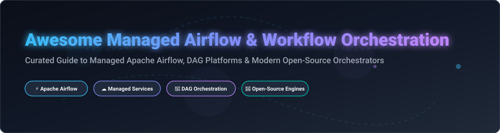

# 🚀 Awesome Managed Workflow Orchestration & Apache Airflow Ecosystem

  

  
  
  
  

---

## 💡 Overview & Ecosystem Insights

Welcome to the ultimate curated list of **Managed Workflow Orchestration** services, **Managed Apache Airflow** solutions, and **Open-Source Data Pipeline Engines**. Whether you are building data engineering pipelines, ML workflows, or microservice orchestrations, this directory compares leading commercial platforms and self-hosted open-source alternatives.

### 📊 Market Size & Industry Structure
> 📈 **Market Size & Dynamics**: The global Workflow Orchestration and Data Pipeline Market is estimated at **$9.5 Billion (2026)** and is projected to reach **$22.8 Billion by 2031**, growing at a CAGR of ~19.2%. The market is **moderately fragmented**, featuring cloud giant monopolies (AWS MWAA, Google Cloud Composer) alongside high-growth venture-backed platforms (Astronomer, Prefect, Dagster, Temporal) and a dominant open-source core powered by Apache Airflow.

---

## 📑 Table of Contents
- [🏢 SaaS & Managed Platforms](#-saas--managed-platforms)
- [🔓 Open-Source Orchestration Engines](#-open-source-orchestration-engines)
- [🛠️ Developer Tools & Helm Charts](#️-developer-tools--helm-charts)
- [🤝 How to Contribute](#-how-to-contribute)
- [❤️ Support & Sponsorship](#️-support--sponsorship)
- [📈 Star History](#-star-history)
- [⚠️ Disclaimer](#%EF%B8%8F-disclaimer)

---

## 🏢 SaaS & Managed Platforms

Below is a comparative matrix of commercial managed workflow orchestration platforms, sorted by **company valuation / scale (descending)**.

| Platform / Vendor | Description & Best For | Pricing (Starting Tier) | Free Tier / Trial Limits | Company Valuation / Revenue Scale (Est.) 🔽 |
| :--- | :--- | :--- | :--- | :--- |
| **[Amazon MWAA](https://aws.amazon.com/managed-workflows-for-apache-airflow/)** ☁️ | Fully managed Apache Airflow on AWS with auto-scaling & CloudWatch. *Best for AWS-native workloads.* | ~$0.49/hr (`mw1.small` env + base worker) | No free tier; 2-month Free Tier for AWS new accounts ($300 credits) | **$1.8+ Trillion** (AWS / Amazon Parent) |
| **[Google Cloud Composer](https://cloud.google.com/composer)** 🌐 | Fully managed Airflow integration natively built into Google Cloud Platform. *Best for GCP pipelines.* | ~$0.35/hr (~$250–$300/mo min base env) | $300 free credits via GCP 90-day New Customer Trial | **$2.0+ Trillion** (Google / Alphabet Parent) |
| **[Astronomer Cloud (Astro)](https://www.astronomer.io/)** 🚀 | Premier enterprise Airflow platform built by core maintainers. *Best for enterprise Airflow.* | $0.35/hr per deployment + compute usage | 14-day Free Trial (includes $300 credit limit) | **$1.3 Billion** ($93M Series D in 2025) |
| **[Temporal Cloud](https://temporal.io/)** ⏳ | Fully managed durable execution platform for mission-critical apps. *Best for microservices & reliable apps.* | $0.0001 per Action + compute consumption | $1,000 free trial credits for 30 days | **$1.5+ Billion** ($100M+ Series B funding) |
| **[Prefect Cloud](https://www.prefect.io/)** 🐍 | Modern Python-native workflow orchestration platform. *Best for Python data pipelines.* | $0 (Hobby) / $185/mo (Pro plan) | Free Forever Hobby Tier (2 users, 500 serverless compute mins/mo) | **$250+ Million** (Series B venture funding) |
| **[Dagster Cloud (Dagster+)](https://dagster.io/)** 🗂️ | Data orchestration platform centered on software-defined assets. *Best for asset-aware data pipelines.* | $10/mo (Solo Plan) + usage credits | 30-day Free Trial (full access to Dagster+ features) | **$150+ Million** ($33M Series B funding) |
| **[Qubole](https://www.qubole.com/)** 📊 | Multi-engine serverless big data platform (Spark, Hive, Airflow). *Best for enterprise big data.* | ~$0.14 per QCUH + cloud infrastructure | 30-day Free Trial | **Acquired by Idera** (Estimated $100M+ valuation) |
| **[Flyte (Union Cloud)](https://flyte.org/)** 🤖 | Managed Flyte for Kubernetes-native AI and ML workflows. *Best for ML & AI pipelines.* | Pay-as-you-go worker compute rates | 30-day Free Trial on Union Cloud | **$50+ Million** (Venture funded by NEA) |
| **[Shipyard](https://www.shipyardapp.com/)** ⚡ | Low-code data workflow automation platform with visual builder. *Best for no-code/low-code data operations.* | $300/mo flat starting rate | 14-day Free Trial (full platform capabilities) | **$10–$50 Million** (Growth stage) |

---

## 🔓 Open-Source Orchestration Engines

Top open-source data workflow and DAG orchestrators sorted by **GitHub Stars_Count (descending)**.

| Project & Repository | Description | Licensing | Stars_Count 🔽 |
| :--- | :--- | :--- | :--- |
| **[Apache Airflow](https://github.com/apache/airflow)** 💨 | The industry de facto standard Python DAG scheduler and workflow platform. | Apache-2.0 |  |
| **[Argo Workflows](https://github.com/argoproj/argo-workflows)** ☸️ | Container-native Kubernetes workflow engine for DAGs and multi-step tasks. | Apache-2.0 |  |
| **[Temporal](https://github.com/temporalio/temporal)** ⏳ | Open-source durable execution engine that runs resilient apps and workflows. | MIT |  |
| **[Prefect](https://github.com/PrefectHQ/prefect)** 🐍 | Python-native workflow automation framework built for modern data stacks. | Apache-2.0 |  |
| **[Apache DolphinScheduler](https://github.com/apache/dolphinscheduler)** 🐬 | Distributed visual DAG workflow scheduler engine supporting high throughput. | Apache-2.0 |  |
| **[Kestra](https://github.com/kestra-io/kestra)** 📜 | Declarative YAML-based workflow orchestration and automation platform. | Apache-2.0 |  |
| **[Dagster](https://github.com/dagster-io/dagster)** 🗂️ | Data orchestrator designed for machine learning, analytics, and ETL software assets. | Apache-2.0 |  |
| **[Windmill](https://github.com/windmill-labs/windmill)** 💨 | Developer-first script & workflow automation platform (Python, TS, Go, Bash). | AGPL-3.0 |  |
| **[Mage AI](https://github.com/mage-ai/mage-ai)** 🪄 | Hybrid notebook-style modern data pipeline engine for data transformations. | Apache-2.0 |  |
| **[Flyte](https://github.com/flyteorg/flyte)** ✈️ | Scalable Kubernetes-native workflow engine engineered for ML and data processing. | Apache-2.0 |  |
| **[Argo Events](https://github.com/argoproj/argo-events)** ⚡ | Event-driven workflow automation framework built natively for Kubernetes. | Apache-2.0 |  |
| **[Luigi](https://github.com/spotify/luigi)** 📦 | Spotify's Python module that builds complex pipelines of batch jobs. | Apache-2.0 |  |
| **[Kubeflow Pipelines](https://github.com/kubeflow/pipelines)** 🧪 | Machine Learning workflow orchestration platform running on top of Kubernetes. | Apache-2.0 |  |
| **[Tekton Pipelines](https://github.com/tektoncd/pipeline)** 🏗️ | Cloud-native Kubernetes CI/CD pipeline execution framework. | Apache-2.0 |  |

---

## 🛠️ Developer Tools & Helm Charts

- **[Astronomer Astro CLI](https://github.com/astronomer/astro-cli)** — Official CLI tool for local Airflow development with Docker. 
- **[Official Airflow Helm Chart](https://github.com/apache/airflow/tree/main/chart)** — Production-grade Kubernetes deployment chart maintained by Apache Airflow.
- **[MWAA Local Runner](https://github.com/aws/aws-mwaa-local-runner)** — Official Amazon CLI tool for testing MWAA DAGs locally. 

---

## 🤝 How to Contribute

Contributions are highly appreciated! To submit a new SaaS platform or Open-Source orchestrator:

1. **Fork** this repository.
2. Edit `README.md` to add your item in alphabetical or sorted order.
3. Ensure accurate details: name, website/repo link, description, pricing, and license.
4. Open a **Pull Request** with a brief summary of the addition.

---

## ❤️ Support & Sponsorship

If you find this curated list helpful for your data engineering team or organization, please consider supporting the project:

- ⭐ **Star** this repository to help others discover it!
- 🔀 **Fork** it to keep your own reference copy.
- 📢 **Share** it on LinkedIn, Twitter/X, or Reddit.
- ☕ **Buy Me a Coffee**: Support ongoing open-source maintenance via the [GitHub Sponsor Dashboard](https://github.com/sponsors/ishandutta2007).

  

---

## 📈 Star History

---

## ⚠️ Disclaimer

- This list is **community-curated** for information purposes and does not constitute an endorsement.
- Managed services cost structures change over time; always consult official pricing pages before provisioning infrastructure.
- Always perform security assessments on self-hosted orchestration components deployed in enterprise networks.
